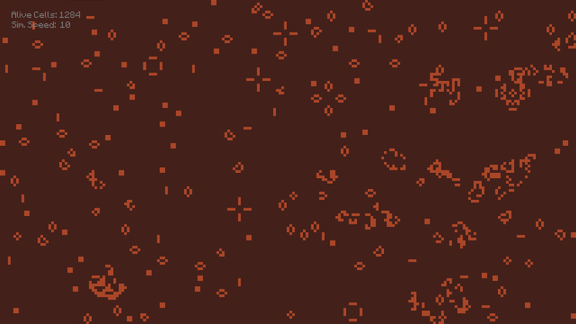

# GameOfLifeCpp
Game of Life in C++ using SFML.

## Controls
* **Right Mouse:** Make the cell alive
* **Left Mouse:** Kill the cell
* **Mouse Wheel:** Control the simulation speed
* **Space:** Play/Pause the simulation
* **C:** Clear the board
* **Z and X:** Cycle palette colors
* **G:** Toggle Grid
* **D:** Toggle status/debug text

## Screenshots

